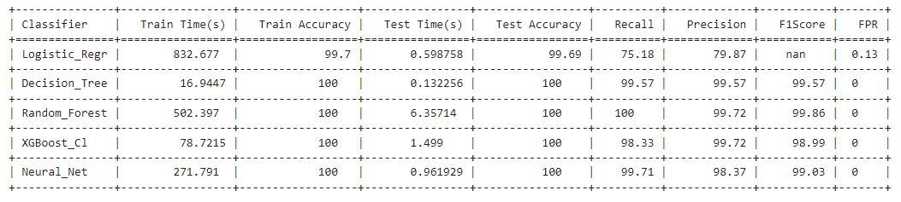

# Aim of the project : 

#### Evaluate machine learning mechanisms for identifying the cyber security attacks using network traffic patterns

# Introduction 

#### Cyber security crimes have more than doubled since the “work from home” has become a norm. In order to ensure the fast discovery of the attack in real time, a smart machine learning methods are required. The proposed solution will be able to address such attack detection


#### Typical cyberattack kill chain is divided into 7 stages (as shown in following figure)

)

### As discussed, though the cyberkill chain is categorized into 7 steps, only 4 steps of it are visible on the network. Aim of this project is to identify the different types of attacks by looking at various aspects of the network traffic between attacker machine and a victim machine.

# Input Data & feature engineering : 
### The selected database from Kaggel @ 	https://www.kaggle.com/datasets/vigneshvenkateswaran/bot-iot provides network traffic pattern vectors that were captured during the cyber attack for different stages (as described in the above figure)

### Overall vectors are distributed among different attack stages as follows: 


### Each of the attack vector or normal vector is defined by 47 features of the IP packet headers. Various fields that are extracted from the IP packet header fields and from the flow of the packets. These 47 fields are used for identifying the type of attack and they help in classification of the attack type.

### The details of each of the features and its distribution accross the dataset using violin plots can be easily found in the code uploaded. Based on the priminary data analysis, the dominant features are identified (which will play important role in classification). 

### Most important part of the data processing step is a generation of **derived features**. 12 features were derived from the existing 35 features which provides more information about the network data flows which care running concurrantly. Such information provides important details for attacks like Reconnaissance, DoD and DDoS.  

### While processing the data, few features like absolute IP addresses, ports IDs etc were removed as their distribution acorss the violin plots was found to be random in nature. 

### Data is also cleaned up for any non-existing entities and NAN values etc. 

# Modeling : 

### In reality, the identification of the various types of attacks is an important requirement so that the appririate action is taken against the ongoing attack. 
### Also based on the above table, it is clear that the provided data is completely unbalanced. So the multi-class classification is a right choice and binary classification is only carried out for validation purposes. 

### For multi-class and binary classification tasks, following modelling alogrithms are selected based on their advantages and disadvantages : 

### **(1) Logistic_Regression** 
### *Advantages :* 
#### &nbsp;&nbsp;&nbsp;Simplicity: Easy to understand and implement.
#### &nbsp;&nbsp;&nbsp;Interpretability: Coefficients provide insight into the relationship between features and the target.
#### &nbsp;&nbsp;&nbsp;Probabilistic Outputs: Provides probability estimates for class membership.
#### &nbsp;&nbsp;&nbsp;Efficiency: Computationally inexpensive and fast to train.
### *Disadvantages:*
#### &nbsp;&nbsp;&nbsp;Assumes Linearity: Assumes a linear relationship between features and the log-odds of the target, which might not capture complex patterns.
#### &nbsp;&nbsp;&nbsp;**Sensitivity to Imbalanced Data:** Standard logistic regression can be biased towards the majority class unless adjustments (e.g., class weights) are made.

### **(2) Decision Trees** 
### *Advantages :* 
#### &nbsp;&nbsp;&nbsp;Interpretability: The tree structure is easy to understand and visualize.
#### &nbsp;&nbsp;&nbsp;Non-Linear Relationships: Can model non-linear relationships between features and target.
#### &nbsp;&nbsp;&nbsp;No Need for Feature Scaling: Works well without needing normalization or scaling of features.
#### &nbsp;&nbsp;&nbsp;Feature Importance: Provides insights into which features are most important for prediction.
### *Disadvantages:*
#### &nbsp;&nbsp;&nbsp;Overfitting: Prone to overfitting, especially on small datasets or noisy data.
#### &nbsp;&nbsp;&nbsp;Bias in Imbalanced Data: Can be biased towards the majority class if not handled properly.

### **(3) Ensamble technique (Bagging) : Random Forest**   
### *Advantages :* 
#### &nbsp;&nbsp;&nbsp;Robustness: Reduces overfitting and is less sensitive to noise compared to individual decision trees.
#### &nbsp;&nbsp;&nbsp;Feature Importance: Can provide feature importance scores.
#### &nbsp;&nbsp;&nbsp;**Handles Imbalanced Data:** More robust to class imbalance compared to single decision trees.
### *Disadvantages:*
#### &nbsp;&nbsp;&nbsp;Computationally Intensive: Requires more resources and time to train and predict due to the ensemble of trees.

### **(4) Ensamble technique (Boosting): XGBoost** 
### *Advantages :* 
#### &nbsp;&nbsp;&nbsp;**High Performance:** Known for speed and accuracy; often performs well in competitive scenarios.
#### &nbsp;&nbsp;&nbsp;**Handling Imbalance:** Effective in handling imbalanced data with parameters like scale_pos_weight
#### &nbsp;&nbsp;&nbsp;Regularization: Built-in L1 and L2 regularization to prevent overfitting.
#### &nbsp;&nbsp;&nbsp;Feature Importance: Provides insights into feature importance and helps in feature selection.
### *Disadvantages:*
#### &nbsp;&nbsp;&nbsp;More complex to tune compared to simpler models like logistic regression.

### **(5) Deep Neural Network (MLP - Multi-Layer Perceptron model)**
### *Advantages :* 
#### &nbsp;&nbsp;&nbsp;Modeling Complex Patterns: Capable of capturing complex non-linear relationships.
#### &nbsp;&nbsp;&nbsp;Flexibility: Can be adapted to various tasks with different architectures and activation functions.
#### &nbsp;&nbsp;&nbsp;Versatility: Handles various types of input data with proper preprocessing.
### **Disadvantages:**
#### &nbsp;&nbsp;&nbsp;Requires Data Preprocessing: Sensitive to feature scaling and requires careful preprocessing.
#### &nbsp;&nbsp;&nbsp;Complexity: Training can be computationally expensive and time-consuming.
#### &nbsp;&nbsp;&nbsp;Overfitting: Prone to overfitting, especially if the network is too complex relative to the amount of data.


```python

```

# Results



### For Cypersecurity threat detection, following parameters are improtant : 
### *High Recall*: Essential for scenarios where missing a threat could be catastrophic. It ensures that most threats are detected, but may come with a trade-off of more false positives.
### *Low FPR*: Important for maintaining operational efficiency and preventing alert fatigue. Ensures that the security team can focus on genuine threats.
### *High F1 Score*: Useful when a balance between Precision and Recall is needed. Provides a holistic view of the system's performance in detecting threats while minimizing both false positives and false negatives.
### *High Precision*: Crucial when the cost of false positives is high, ensuring that alerts are reliable and actionable.

### Based on the various parameters **XGBoost classifier** is suggested for multi-class and binary classification 


```python

```


```python

```


```python

```
