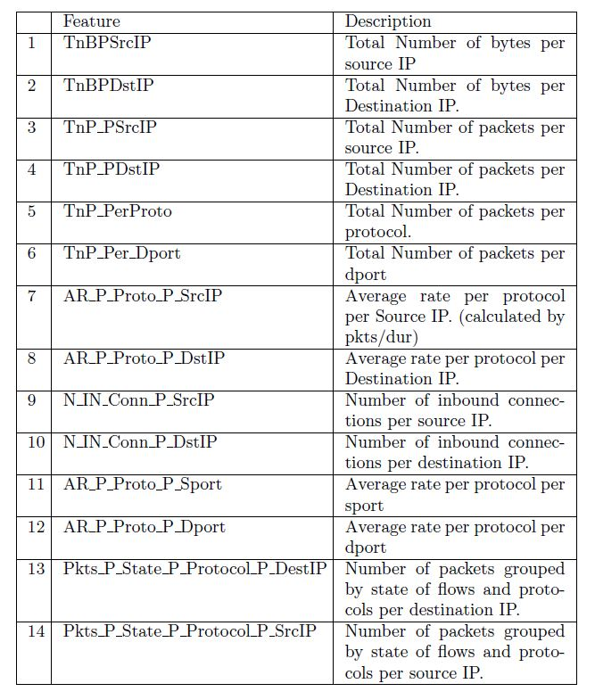

# Aim of the project : 

#### Evaluate machine learning mechanisms for identifying the cyber security attacks using network traffic patterns

# Introduction 

#### Cyber security crimes have more than doubled since the “work from home” has become a norm. In order to ensure the fast discovery of the attack in real time, a smart machine learning methods are required. The proposed solution will be able to address such attack detection


#### Typical cyberattack kill chain is divided into 7 stages (as shown in following figure)

)

### The selected database from Kaggel @ 	https://www.kaggle.com/datasets/vigneshvenkateswaran/bot-iot
### provides network traffic pattern vectors that were captured during the cyber attack for different stages (as described in the above figure)


### Overall vectors are distributed among different attack stages as follows: 


### Each of the attack vector or normal vector is defined by 47 features of the IP packet headers. Various fields that are extracted from the IP packet header fields are listed below


### Apart from above features, the database was created using following derived features from existing network flows. 



### While processing the data, few features like absolute IP addresses, ports IDs etc were removed and only traffic patterns were used for training the models.

### Various classifiers like 
### (1) Logistic_Regression <BR> (2) Decrision Trees <BR> (3) Ensamble technique (Bagging) : Random Forest  <BR> (4),Ensamble technique (Boosting): XGBoost <BR> (5))Deep Neural Network (MLP - Multi-Layer Perceptron model)

### are used for evluating the best performance parameters Net'

### Based on the various results **XGBoost classifier** is suggested for binary and multi-class classification 


```python

```


```python

```


```python

```
